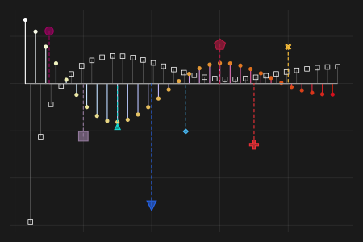
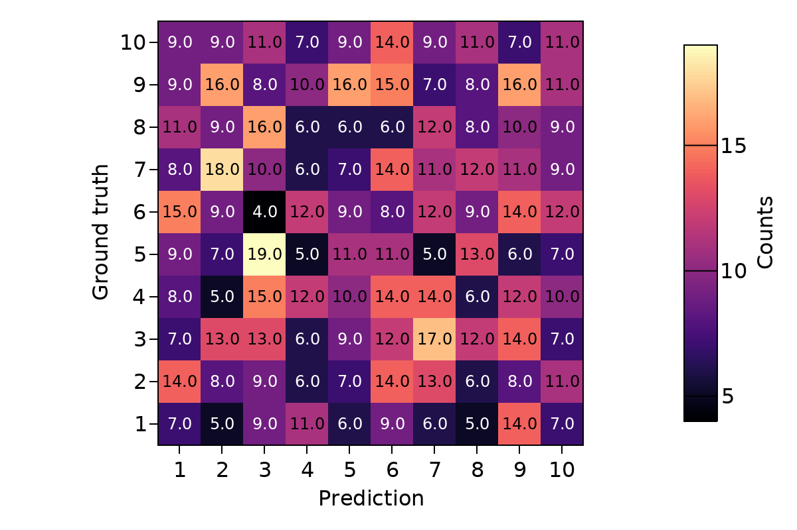

# 100daysOfMakie
100 days of Makie examples. And now that you are here, check also [Beautiful Makie](https://lazarusa.github.io/BeautifulMakie/).

Want to know more about data science, `Julia` and `Makie`? Checkout the [upcoming book](https://github.com/JuliaDataScience/JuliaDataScience) [Julia Data Science](https://juliadatascience.io).

Plotting scripts written with Makie and formatted with [Carbon](https://carbon.now.sh).

|   |   |   |
|---|---|---|
|[Lines, hypotrochoid curve](#1-lines-hypotrochoid-curve)|[Meshes](#21-meshes)   |   |
|[Scatters, bubbles](#2-scatters-bubbles)   |[Volume](#22-volume-potentials)  |   |
|[Scatterlines, archimedes spiral](#3-scatterlines-archimedes-spiral)| [Wireframe and surface](#23-wireframe-and-surface)   |   |
|[Linesegments](#4-linesegments)|[Streamplot](#24-streamplot)   |   |
|[Polygons, ngons](#5-polygons-ngons)|[Arrows, normals](#25-arrows-normals)|   |
|[Barplot](#6-barplot)|[Image transformations](#26-image)   |   |
|[Stairs](#7-stairs)|[Candle Stick](#27-candle-stick)|   |
|[Series](#8-series)|[contour3d, contour, lines, wireframe](#28-contour3d-contour-lines-wireframe)|   |
|[Density](#9-density)|[Contourf](#29-contourf)|   |
|[Histograms](#10-histograms)|[Band Horizontal](#30-band-horizontal)   |   |
|[Violins](#11-violins)|[Stripped Patterns](#31-stripped-patterns)   |   |
|[Boxplot](#12-boxplot)|[Confusion Matrix](#32-confusion-matrix)   |   |
|[Band, confidence interval](#13-band-confidence-interval)|   |   |
|[Barplot and errorbars](#14-barplot-and-errorbars)|   |   |
|[Errorbars in x and y](#15-errorbars-in-x-and-y)|   |   |
|[Stem plot](#16-stem-plot)|   |   |
|[Helix, 3d Scatter](#17-helix-3d-scatters)|   |   |
|[Band 3d bessel functions](#18-band-3d-bessel-functions)|   |   |
|[Meshscatter](#19-meshscatter)|   |   |
|[Surface torus](#20-surface-torus)|   |   |

## 1. Lines, hypotrochoid curve

 

## 2. Scatters, bubbles

 

## 3. Scatterlines, archimedes spiral

 

## 4. Linesegments

 

## 5. Polygons, ngons

 

## 6. Barplot

 

## 7. Stairs

 

## 8. Series

 

## 9. Density

 

## 10. Histograms

 

## 11. Violins

 

## 12. Boxplot

 

## 13. Band, confidence interval

 

## 14. Barplot and errorbars

 

## 15. Errorbars in x and y

 

## 16. Stem plot

 

## 17. Helix 3d scatters

 

## 18. Band 3d bessel functions

 

## 19. Meshscatter

 

## 20. Surface torus

 

## 21. Meshes

 

## 22. Volume potentials

 

## 23. Wireframe and Surface

 

## 24. Streamplot

 

## 25. Arrows normals

 

## 26. Image

 

## 27. Candle Stick

 

## 28. contour3d, contour, lines, wireframe

 

## 29. Contourf

 

## 30. Band Horizontal

 

## 31. Stripped Patterns

 

## 32. Confusion Matrix

 

