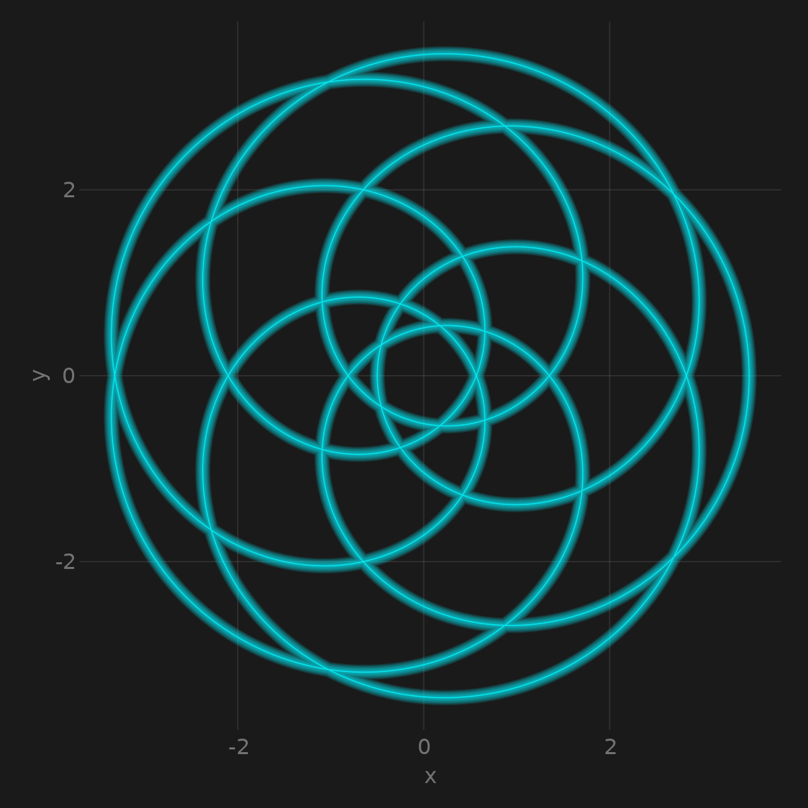

# 100daysOfMakie
100 days of Makie examples.

Want to know more about data science, `Julia` and `Makie`? Checkout the [upcoming book](https://github.com/JuliaDataScience/JuliaDataScience) [Julia Data Science](https://juliadatascience.io).

Plotting scripts written with Makie and formatted with [Carbon](https://carbon.now.sh).

1. Lines, hypotrochoid curve

 

2. Scatters, bubbles

 

3. Scatterlines, archimedes_spiral

 

